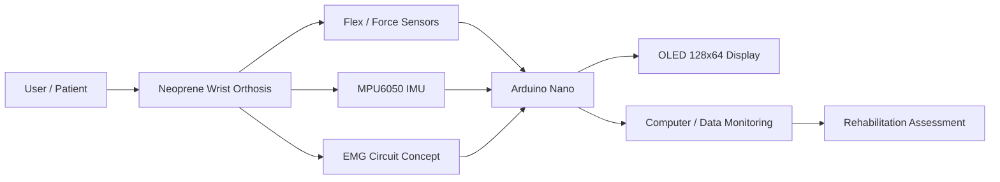
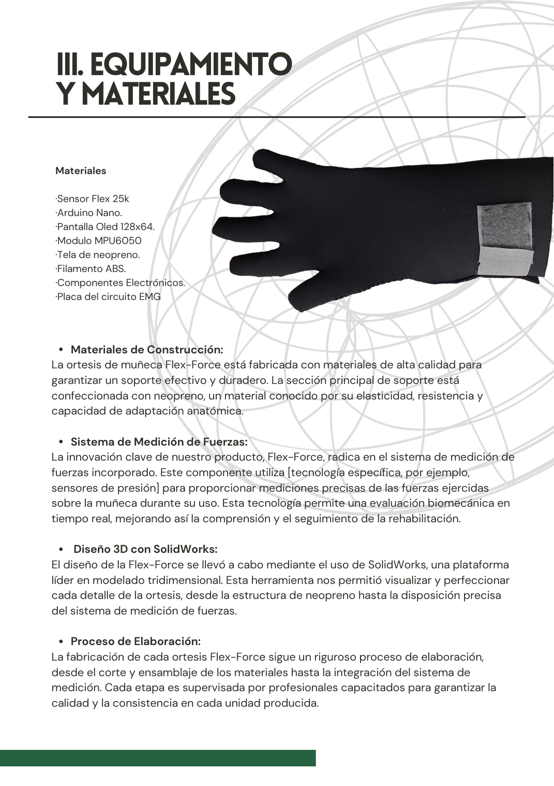
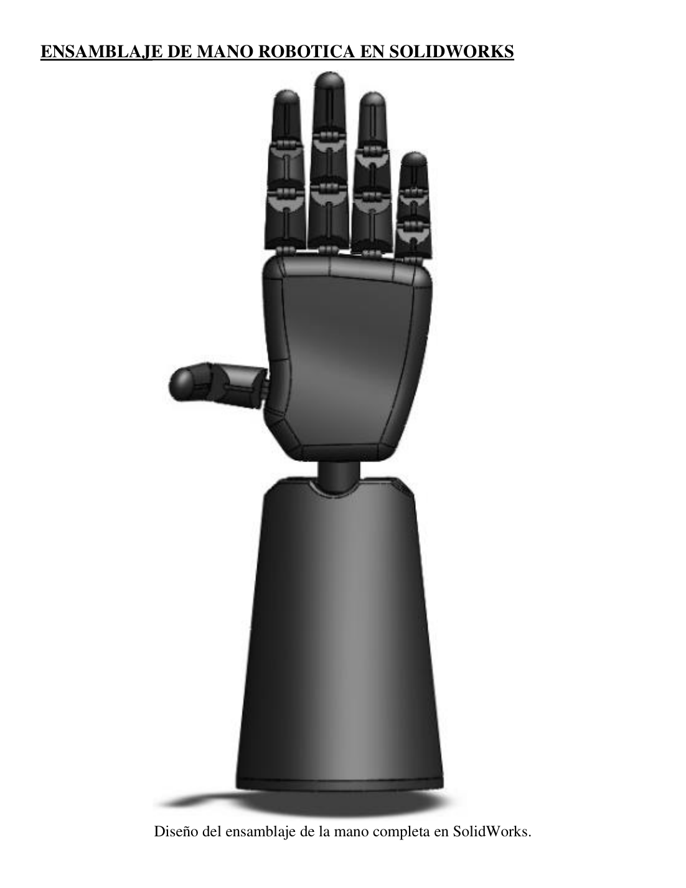
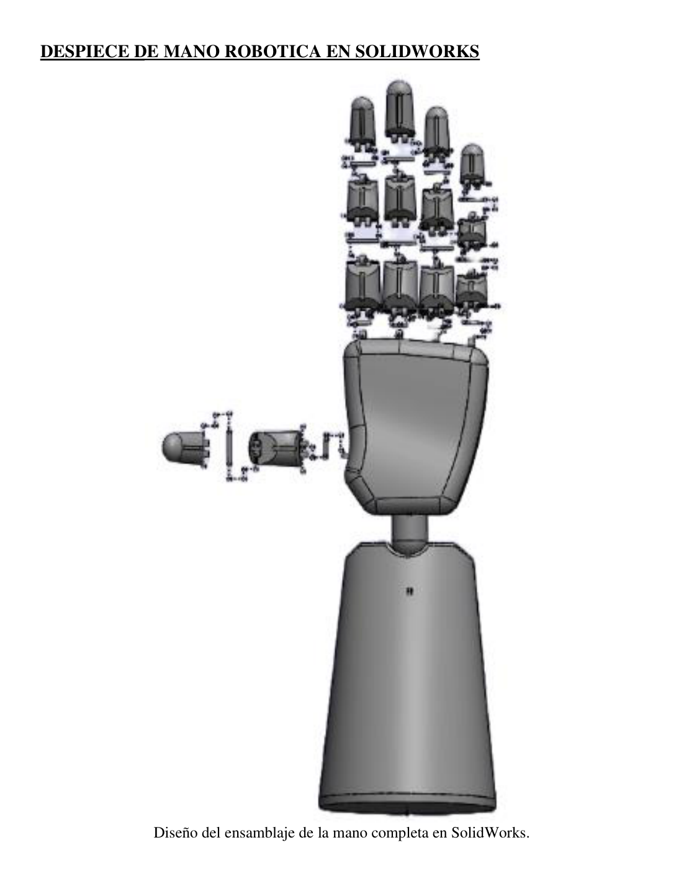
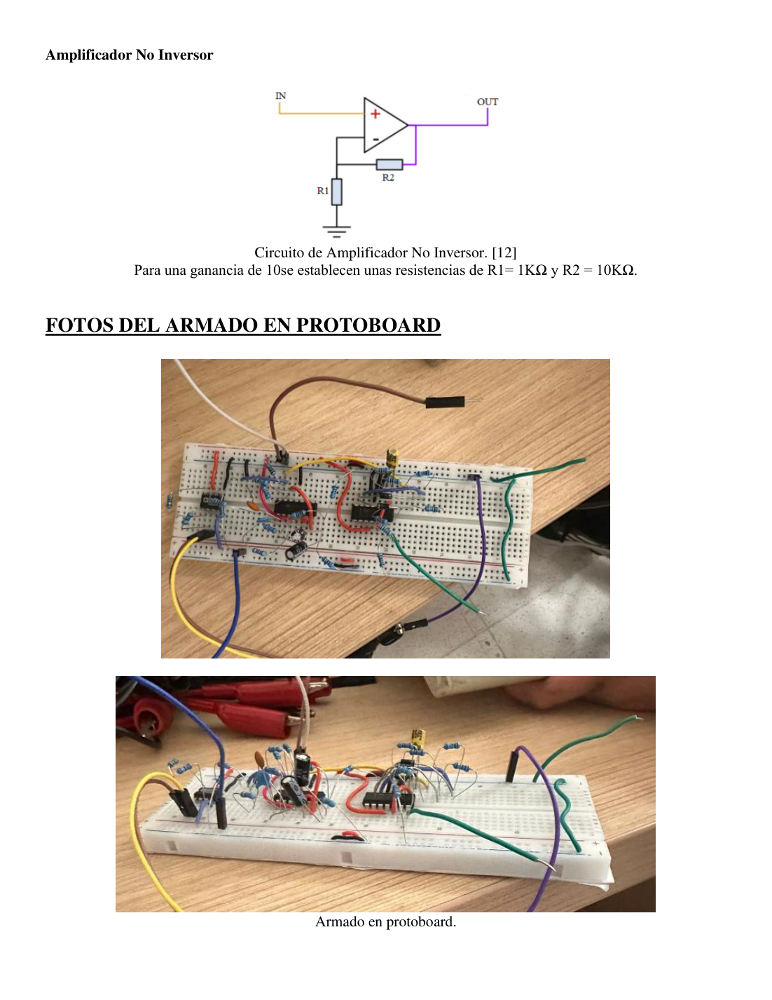
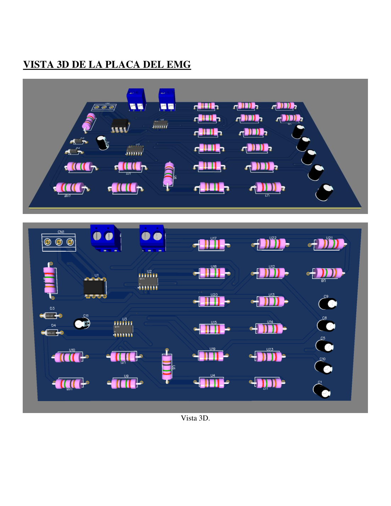
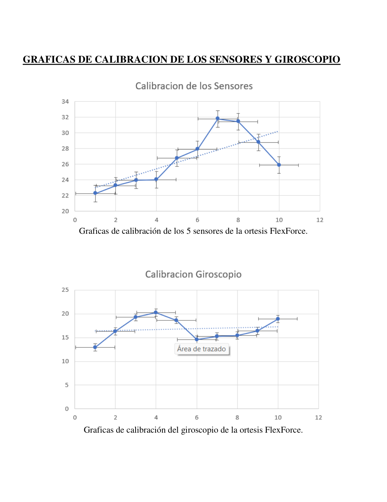

# Flex-Force Wrist Orthosis

Smart biomedical engineering prototype for wrist rehabilitation support and quantitative motion monitoring.

**Flex-Force** is an academic biomedical device project focused on the design of a wrist orthosis for patients with post-fracture mobility limitations. The prototype combines a wearable neoprene-based orthosis, 3D-modeled structural components, flex/force-sensing elements, an MPU6050 inertial sensor, an OLED display, and an EMG acquisition circuit concept to support objective rehabilitation monitoring.

> **Academic prototype disclaimer:** This repository documents a university engineering prototype. It is not a certified medical device and must not be used for diagnosis, treatment, or clinical decision-making without professional validation and regulatory approval.

---

## Project Motivation

Wrist fractures can lead to reduced range of motion, loss of strength, and difficulties performing daily activities. Rehabilitation follow-up often depends on subjective observation or comparison with the contralateral hand. This project addresses the need for a more objective way to monitor wrist recovery through measurable data such as movement angles, muscular activity, and force-related measurements.

---

## Objectives

- Design a wrist orthosis that provides support without fully restricting movement.
- Monitor wrist motion and rehabilitation progress using quantitative measurements.
- Integrate flexible sensing elements for finger/wrist interaction assessment.
- Include an MPU6050 module for wrist angle estimation.
- Explore EMG acquisition from forearm muscles as a complementary rehabilitation signal.
- Develop a low-cost, accessible, and customizable biomedical prototype.

---

## System Overview



---

## Main Components

| Component | Purpose |
|---|---|
| Arduino Nano | Microcontroller for signal acquisition and device control |
| Sensor Flex 25K | Flexible sensor concept for movement or force-related measurements |
| MPU6050 | Inertial measurement unit for angular motion estimation |
| OLED 128x64 Display | Local visualization of measurements |
| EMG circuit | Forearm muscle activity acquisition concept |
| Neoprene | Flexible and comfortable orthosis body material |
| ABS filament | 3D-printed structural support components |
| Copper board and ferric chloride | PCB fabrication for the EMG circuit |

---

## Prototype and Design Evidence

### Orthosis concept and material integration



### SolidWorks assembly



### SolidWorks exploded view



### EMG circuit prototyping



### EMG PCB design



### Sensor and gyroscope calibration



---

## Methodology

The project followed a biomedical product-development workflow:

1. **Clinical problem definition**  
   Identification of wrist fracture sequelae and rehabilitation limitations.

2. **Background research**  
   Review of wrist fracture mechanisms, orthosis types, rehabilitation needs, and common anatomical/functional limitations.

3. **Conceptual design**  
   Definition of a wearable orthosis that combines support, comfort, and measurement capabilities.

4. **3D design and structural modeling**  
   SolidWorks was used to model the robotic hand/orthosis support concept and visualize assembly components.

5. **Sensor and electronics integration**  
   Arduino Nano, Sensor Flex 25K, MPU6050, OLED display, and EMG circuitry were considered for signal acquisition and visualization.

6. **EMG circuit design**  
   The EMG stage included an AD620 instrumentation amplifier, filtering stages, offset conditioning, and signal processing concepts.

7. **Calibration and validation concept**  
   Calibration plots were generated for the sensors and gyroscope to analyze measurement behavior.

---

## Repository Structure

```text
flex-force-wrist-orthosis/
├── README.md
├── LICENSE
├── DISCLAIMER.md
├── requirements.txt
├── .gitignore
├── assets/
│   ├── figures/
│   ├── photos/
│   └── diagrams/
├── data/
│   └── README.md
├── docs/
│   ├── methodology.md
│   ├── project_summary.md
│   ├── technical_design.md
│   ├── mext_interview_notes.md
│   └── source_materials_note.md
├── firmware/
│   └── README.md
├── hardware/
│   ├── bom.csv
│   ├── components.md
│   ├── emg_circuit_notes.md
│   └── calibration_notes.md
├── notebooks/
│   └── README.md
└── src/
    └── README.md
```

---

## Current Repository Scope

This repository currently documents the project concept, design, hardware architecture, EMG circuit notes, calibration evidence, and presentation-derived visuals. Source firmware, CAD files, and raw calibration datasets can be added in future versions if available.

---

## Future Improvements

- Add Arduino firmware for sensor acquisition.
- Add Python scripts for serial data logging and calibration analysis.
- Include CAD files or STL exports if redistribution is allowed.
- Improve signal conditioning and validation for the EMG stage.
- Add a structured experimental protocol for sensor calibration.
- Compare sensor readings against a clinical goniometer.
- Develop a simple dashboard for rehabilitation progress monitoring.

---

## Skills Demonstrated

- Biomedical device design
- Rehabilitation engineering
- Orthosis concept development
- SolidWorks 3D modeling
- Arduino-based instrumentation
- EMG circuit design
- Sensor calibration
- PCB design concepts
- Technical documentation

---

## License

This repository is released under the MIT License for documentation and source files included here. Hardware designs, medical use, images, and institutional materials may be subject to their own restrictions.

---

## Author

Luis Manuel Moran Garcia  
Biomedical Engineering
